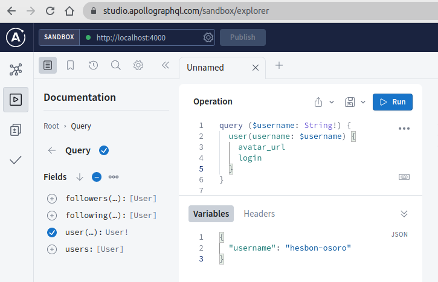
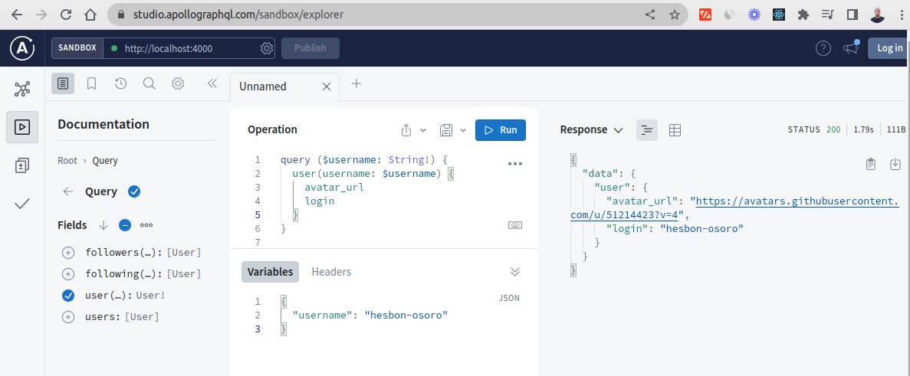
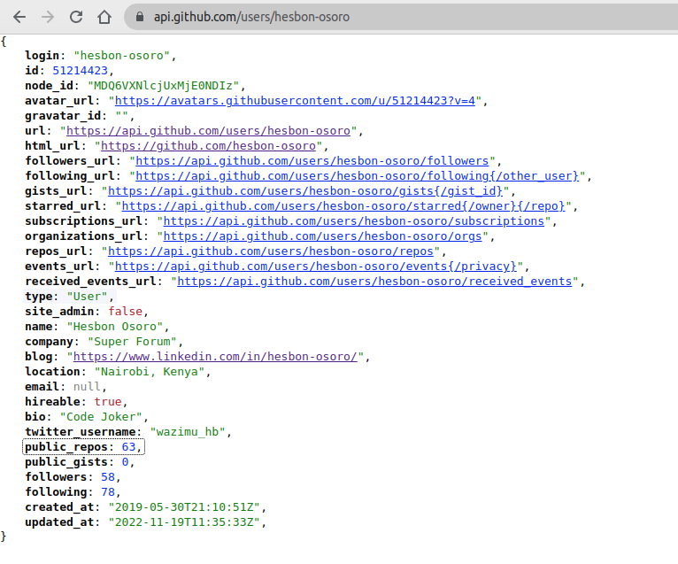
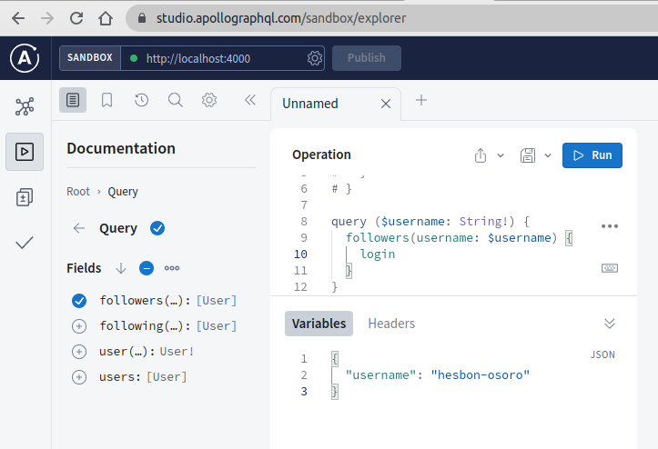
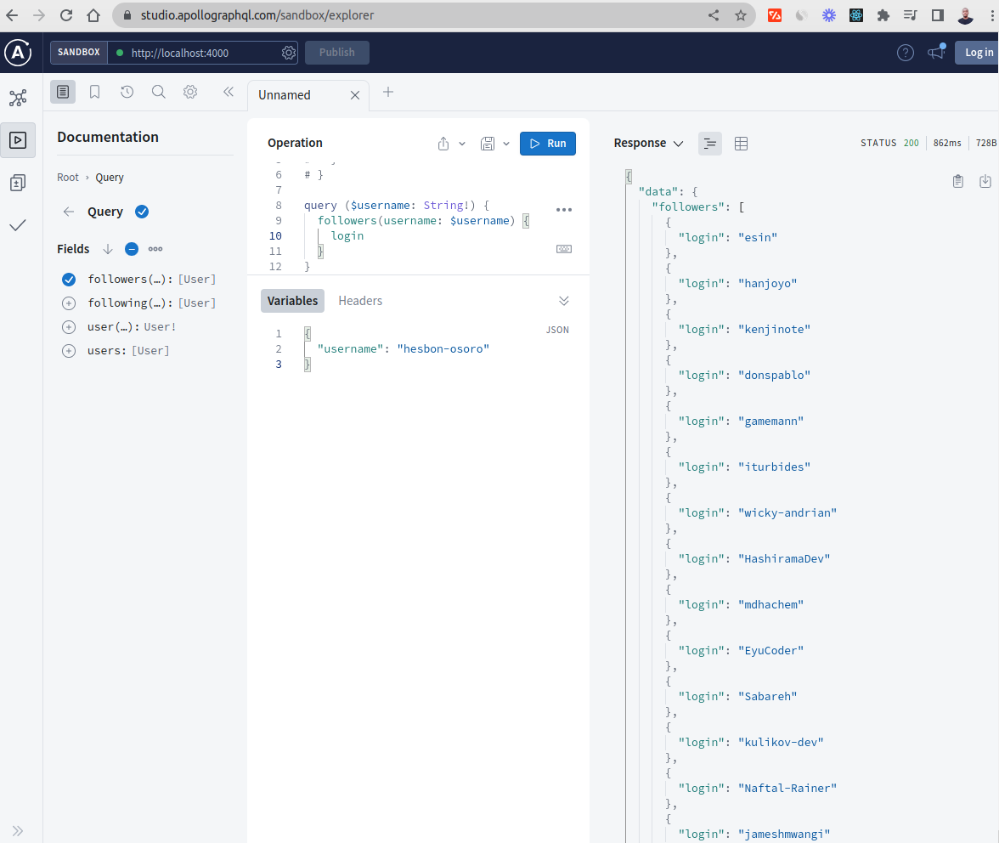
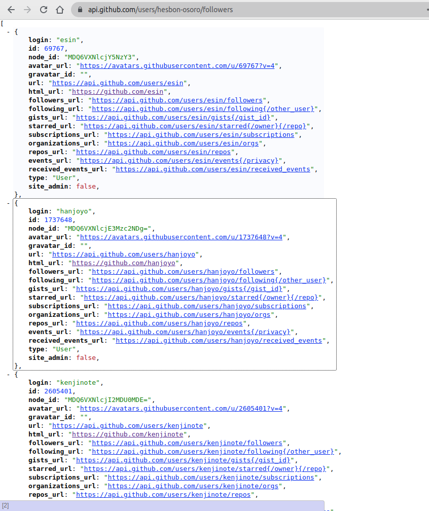

# GitHub GraphQL Server

Quickly convert GitHub REST API into GraphQL server.

Let Client request exact data using GraphQL Apollo Server

## Technologies

- Apollo Server
- TypeScript
- Node
- Axios
- GraphQL
- REST API
- GitHub

## Setup

```code
# Clone the repo
git clones https://github.com/hesbon-osoro/github-graphql-server.git

# Navigate to directory and install packages
cd github-graphql-server && yarn

# Start the Apollo Server
yarn start
```

Open the GraphQL explorer at [`localhost:4000`](http://localhost:4000) or [`localhost:4000/api/graphql`](localhost:4000/api/graphql)

Start requesting the exact data that you need unlike the REST API that provides all the data.

Demo





# REST User response







# REST Followers response


